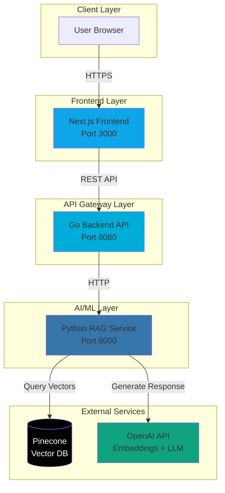
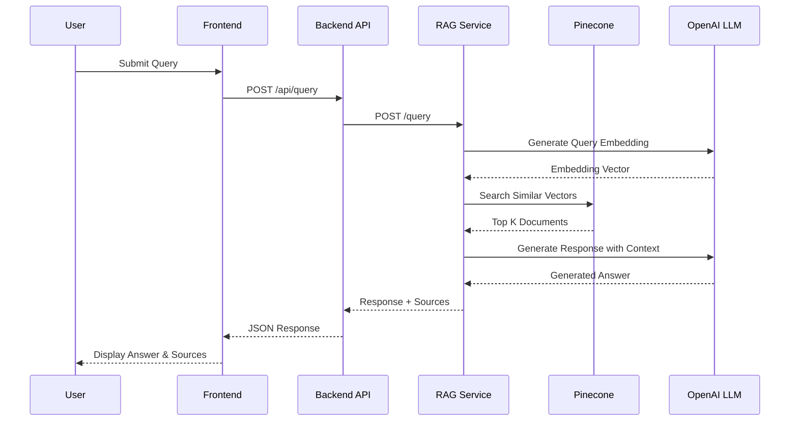
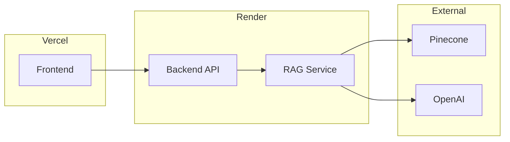

# Financial RAG Assistant - Architecture

## System Architecture

## Data Flow

## Component Responsibilities

### Frontend (Next.js)
- **Technology**: Next.js 14, TypeScript, Tailwind CSS
- **Responsibilities**:
  - User interface for query input
  - Display responses and sources
  - Error handling and loading states
- **Port**: 3000

### Backend API (Go)
- **Technology**: Go 1.21, Gin framework
- **Responsibilities**:
  - API gateway and request routing
  - Input validation and sanitization
  - CORS and security headers
  - Rate limiting and timeout management
- **Port**: 8080

### RAG Service (Python)
- **Technology**: Python 3.11, FastAPI, LangChain
- **Responsibilities**:
  - Query embedding generation
  - Vector similarity search
  - Context retrieval from Pinecone
  - LLM prompt construction
  - Response generation
- **Port**: 8000

### Vector Database (Pinecone)
- **Type**: Managed cloud service
- **Responsibilities**:
  - Store document embeddings
  - Semantic similarity search
  - Metadata filtering

### LLM Provider (OpenAI)
- **Models**: 
  - Embeddings: text-embedding-ada-002
  - Generation: gpt-3.5-turbo or gpt-4
- **Responsibilities**:
  - Generate text embeddings
  - Generate contextual responses

## Security Considerations

1. **Input Validation**: Query length limits (max 1000 chars)
2. **CORS**: Restricted to known origins
3. **API Keys**: Stored in environment variables, never in code
4. **Docker**: Non-root users in containers
5. **HTTPS**: Required for production deployments
6. **Rate Limiting**: Implemented at API gateway level

## Scalability

- **Horizontal Scaling**: Each service can scale independently
- **Caching**: Embedding cache to reduce API calls
- **Async Processing**: Non-blocking I/O in all services
- **Connection Pooling**: Reuse HTTP connections

## Deployment Architecture

